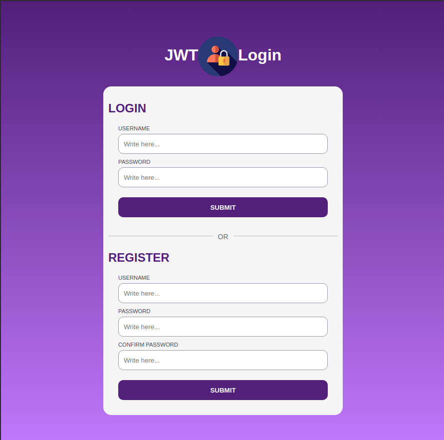

# auth-react  

Documentación sobre las diferentes formas de autenticación Web (JWT, Sesiones, OAuth) con ejemplos creados en React

### [JWT](./jwt/jwt.md)

# License

MIT. Copyright (c) Héctor Rivas

